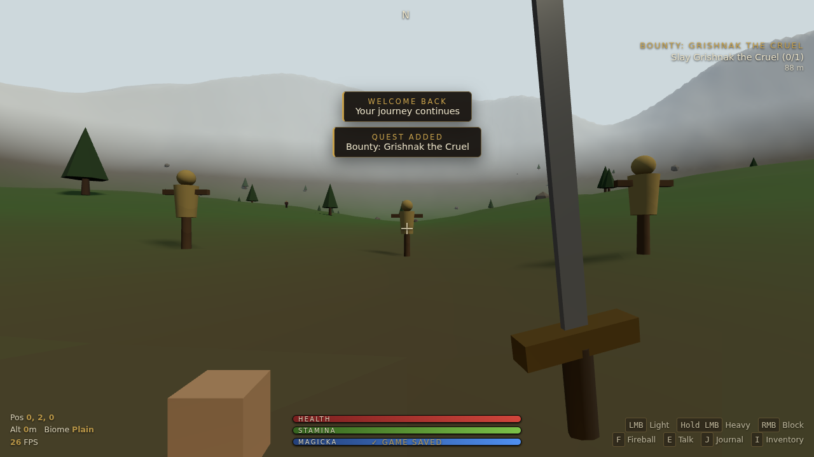
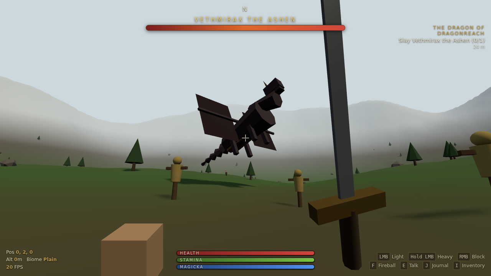
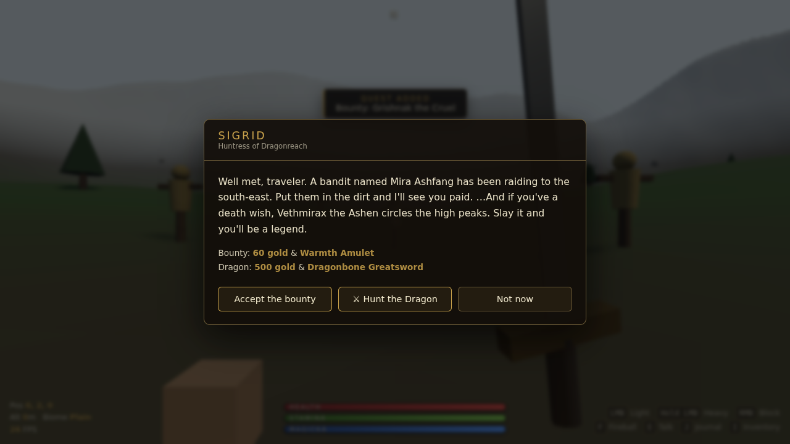
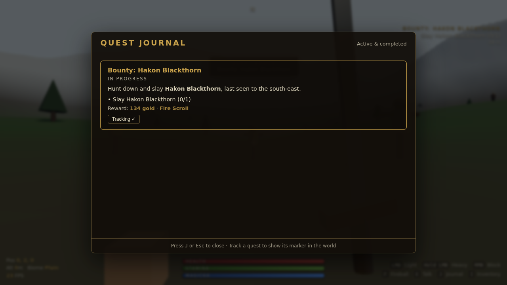
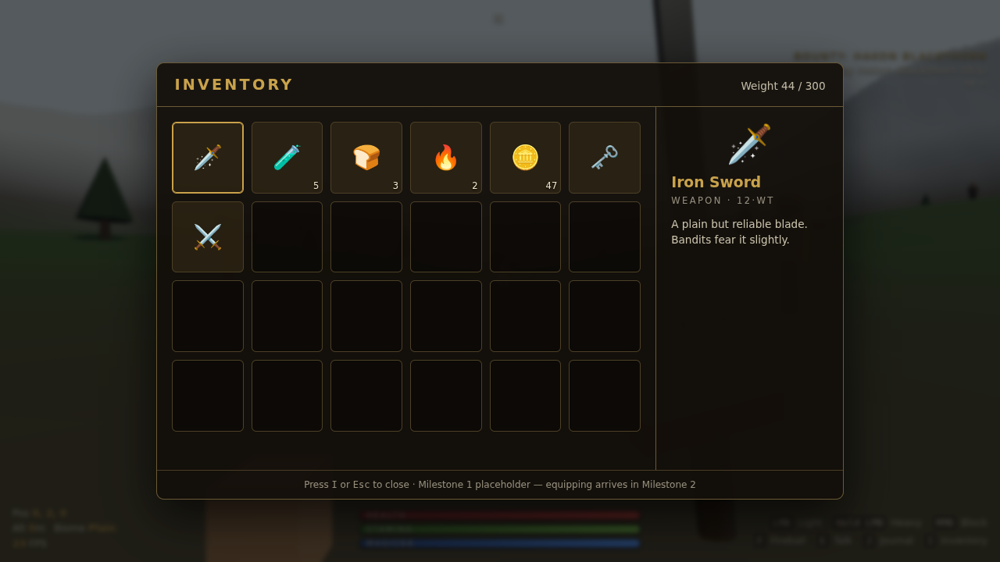

# Dragonreach — a first-person open-world RPG

A high-fantasy, first-person open-world action RPG built with HTML5 + Three.js (WebGL).
Lives under `/game/` so it is fully isolated from the rest of the site.

## Preview

| The open world | The Dragon boss |
| --- | --- |
|  |  |

| NPC dialogue | Quest journal | Inventory |
| --- | --- | --- |
|  |  |  |

**Play it live:** once this branch is merged to the default branch, GitHub Pages serves it at
`https://<your-domain>/game/`. To try this branch before merging, run it locally (below).

## Milestone 1 — Foundation & Player ✅
- Decoupled camera + first-person controller (yaw/pitch rig, gravity, jump, sprint)
- Procedurally generated mountainous open-plain world (seeded value-noise heightfield)
- Placeholder inventory screen driven by an authoritative `GameState`

## Milestone 2 — Combat & Magic ✅
- Melee: **light** attack (tap LMB), **heavy** attack (hold LMB + release), **block** (hold RMB)
  with a first-person sword viewmodel that winds up, swings, and guards
- Spellcasting: **fireball** (`F`) — a projectile with a point-light, terrain/dummy
  collision, and an AoE explosion with distance falloff
- **Health / Stamina / Magicka** pools with per-pool regen delays, spend costs, and HUD bars;
  stamina gates sprinting, blocking, and swings; magicka gates casting
- Fall damage, floating damage numbers, hurt/guard vignettes
- Procedural **training dummies** (destructible, auto-respawn); one **spars back** on a
  fixed cadence so blocking and health are testable before enemy AI (Milestone 3)

## Milestone 3 — World, NPCs & Quests ✅
- Interactive quest-giver NPC (**Sigrid**) with a dialogue overlay (accept / track / turn-in);
  walk up and press `E`
- **Radiant** "Kill the Bandit" bounty — randomized target name, world location, and reward
  each time; repeatable after turn-in
- **Quest journal** (`J`): active + completed quests, live objective counters, rewards, and a
  per-quest *Track* toggle; plus an always-on HUD **quest tracker** with distance and a
  floating in-world beacon over the target
- **Bandit enemy AI**: `patrol` (wander waypoints) → `chase` (aggro on sight or when struck) →
  `attack` (telegraphed, blockable strikes), with a billboarded health bar and death/topple
- Bandits share the Milestone 2 damage pipeline (sword + fireball kill them); a kill advances
  the objective, and turning in pays **gold + item straight into the Milestone 1 inventory**
- Toast notifications for quest events

## Milestone 4 — The Dragon & Persistence ✅
- **The Dragon** (`Vethmirax the Ashen`): a procedural aerial boss with a
  `circle → dive → firebreath → climb` flight AI, flapping wings, a boss health
  bar, and a fire-cone breath attack that damages the player. Offered by Sigrid
  as *"Hunt the Dragon"*; killable with fireballs (and melee when it swoops low)
- **Persistence** (the vision's *persistent inventories*): `localStorage`
  save/load of inventory, quest log, and player state — autosaves on quest
  events, every 20 s, and on exit; restores on boot and **re-spawns active-quest
  targets** so the world matches. Fully `try/catch`-guarded so a bad save can
  never brick the boot

Vendored Three.js locally under `vendor/` so the game has **no runtime CDN dependency**.
Progress is saved under the `localStorage` key `dragonreach_save_v4` — clear it to start fresh.

### Debug handle
Append `?debug=1` to the URL to expose `window.DR` (`GameState`, `CONFIG`, `startAttack`,
`castFireball`, `damagePlayer`, `generateBanditQuest`, `acceptQuest`, `turnInQuest`,
`damageBandit`, `camPos()`, and a `sim(dt)` step) for tinkering/automated tests.

### Run it
Everything is one self-contained file — no build step.

- **Live (GitHub Pages):** `https://<your-domain>/game/`
- **Local:** serve the repo root over HTTP and open `/game/index.html`:
  ```bash
  cd richiefurmah.github.io
  python3 -m http.server 8000
  # then visit http://localhost:8000/game/
  ```
  (Opening the file with `file://` will fail — ES modules require an HTTP origin.)

### Controls
| Key | Action |
| --- | --- |
| `W` `A` `S` `D` / Arrows | Move |
| Mouse | Look |
| `Shift` | Sprint |
| `Space` | Jump |
| `LMB` (tap) | Light attack |
| `LMB` (hold + release) | Heavy attack |
| `RMB` (hold) | Block |
| `F` | Cast fireball |
| `E` | Talk to nearby NPC |
| `J` | Toggle quest journal |
| `I` | Toggle inventory |
| `Esc` | Release cursor |

## Architecture notes
- **`GameState` is the single source of truth.** Every system reads/writes it; nothing keeps
  a private copy of shared state. This is the seam a future server authority plugs into
  (GitHub Pages is static hosting, so true server authority is deferred).
- **One shared height field** feeds both terrain rendering and player collision, so what you
  see is exactly what you stand on.
- **All assets are procedural** (terrain, boulders, conifers, sky, lighting) — no external art.

## Roadmap
- Milestone 2 — Combat & Magic (light/heavy attacks, blocking, fireballs, health/stamina)
- Milestone 3 — World, NPCs & Quests (radiant "Kill the Bandit" quest, journal, enemy AI)
